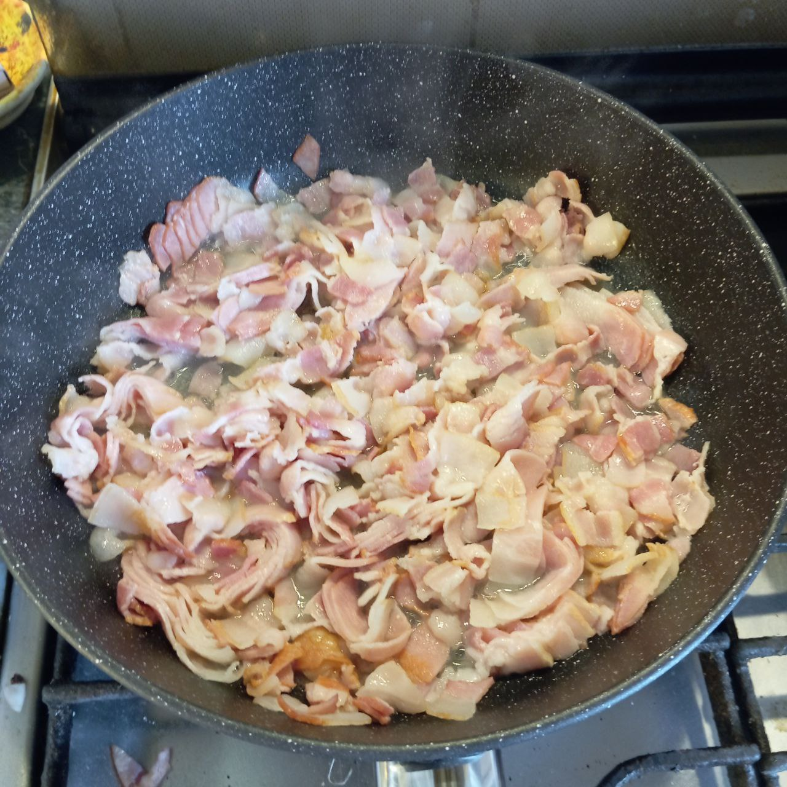
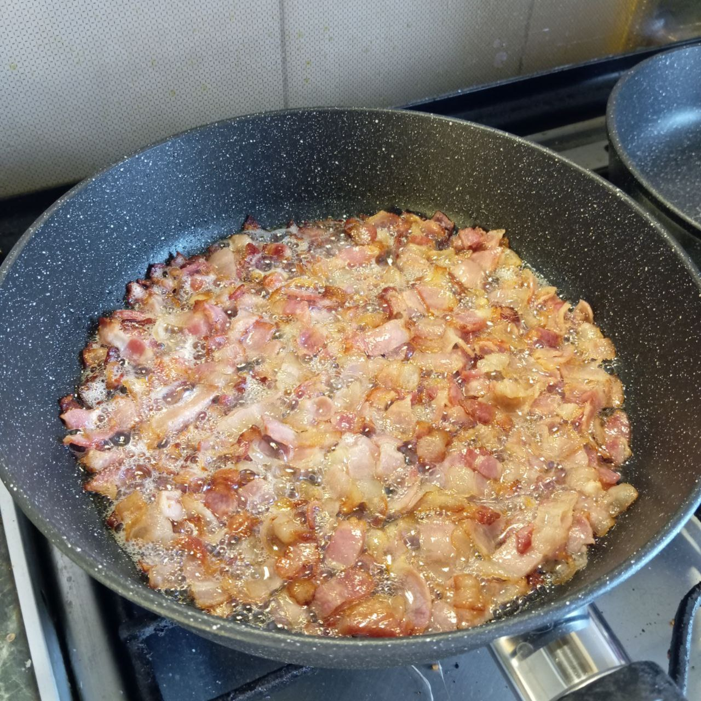
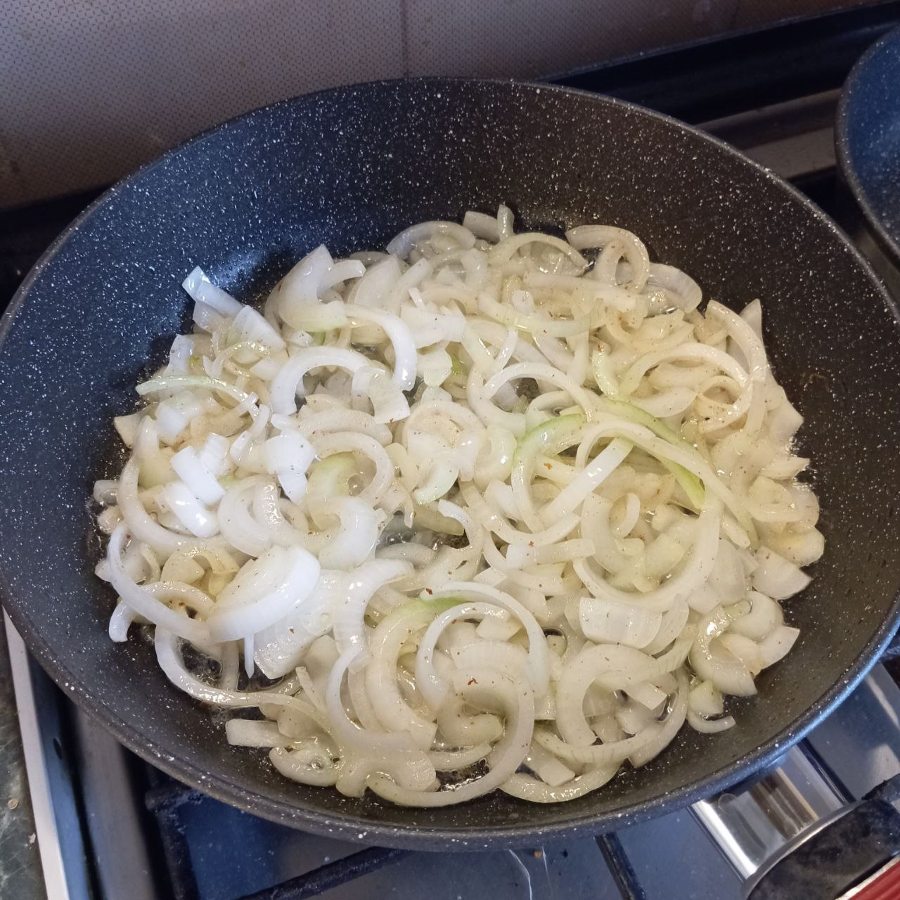
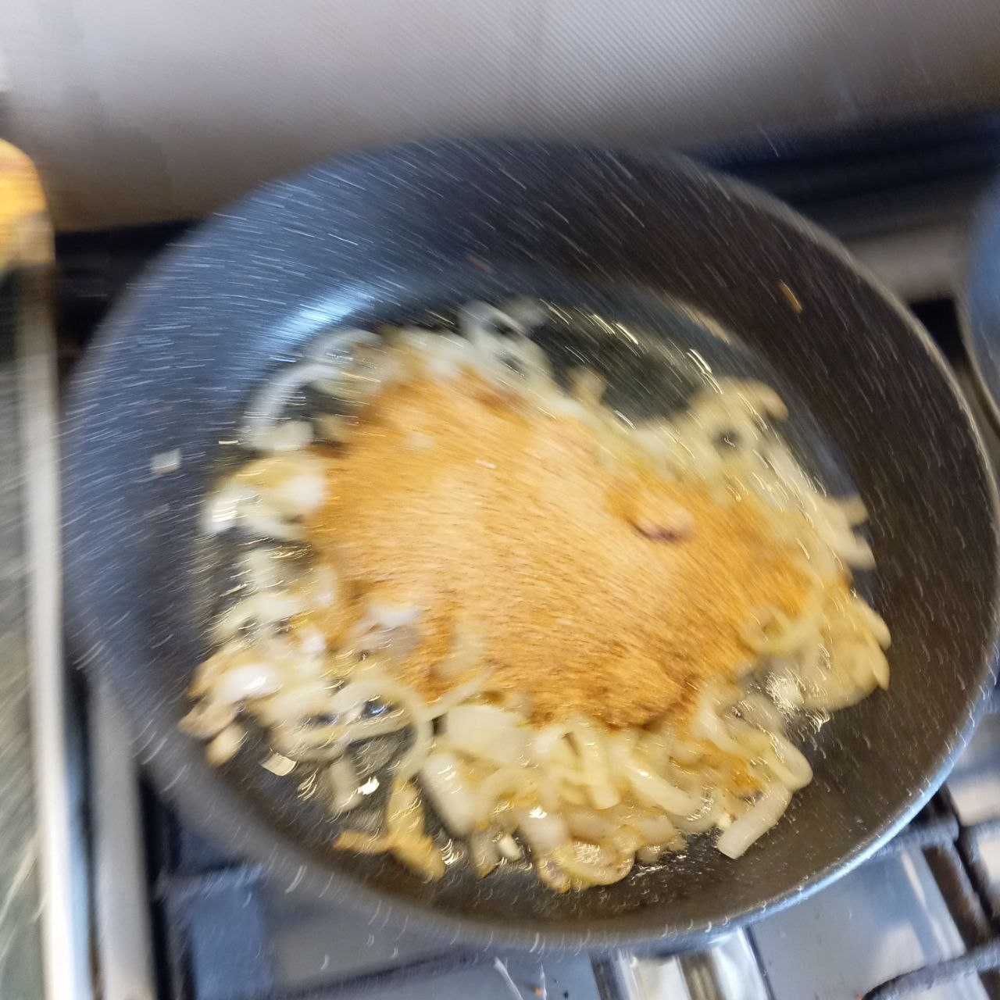
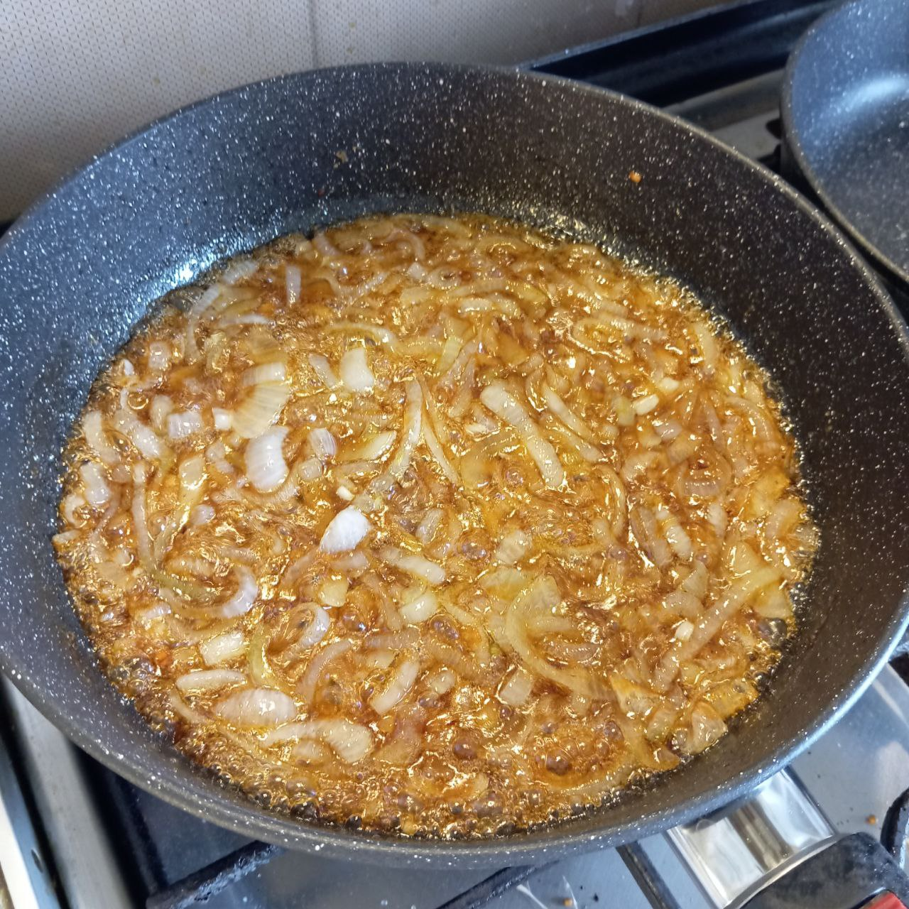
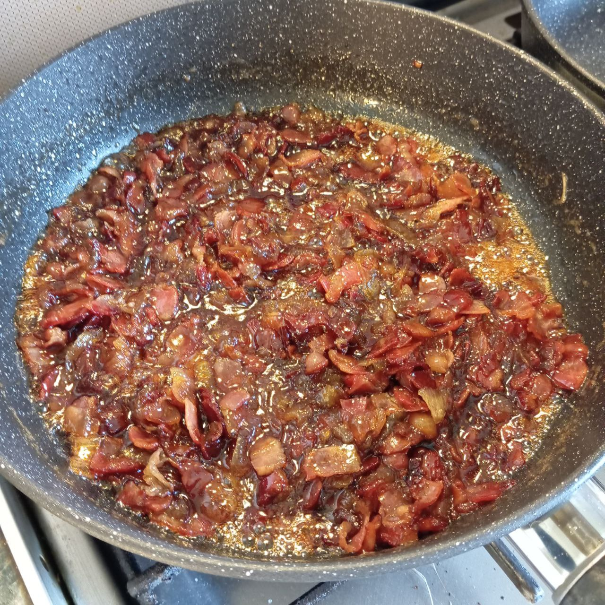
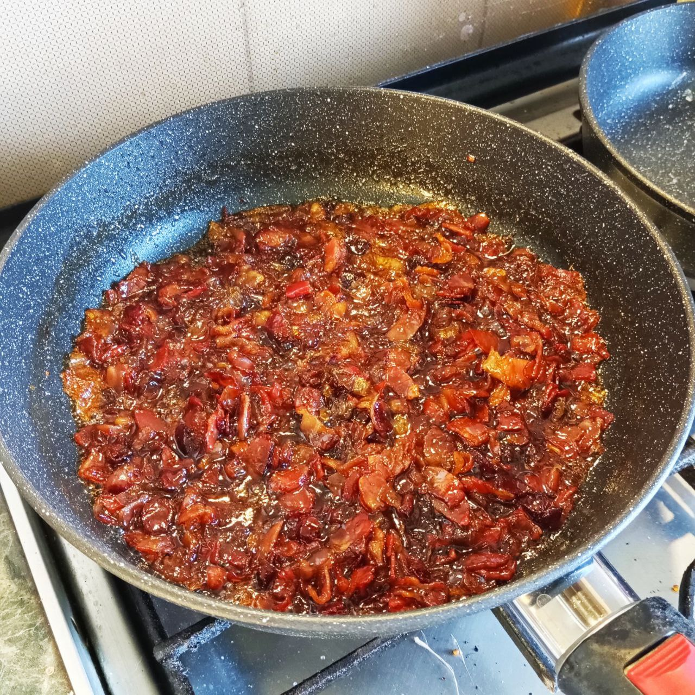

# BOURBON BACON JAM
Оригинальный рецепт тут https://www.youtube.com/watch?v=QMSxdoBsFxk

## Ингредиенты:
1. Бекон - 450 г или две пачки
2. Лук желтый или белый - 400 г. Или больше, лук сильно ужарится.
3. Сахар коричневый - 125 г.
4. Вода 125 мл.
5. Бурбон - 100 мл
6. Бальзамический уксус - 1 ст. л.

## Приготовление

Взять большую сковороду

Нанезать бекон поперек на кусочки тошщиной с палец.

Начать вытапливать бекон на малом и среднем огне.

Когда бекон поджарится до состояния шкварок переложить его в отдельную емкость и можно его немного покрошить если куски все еще крупные.
 

Жир слить и оставить пару столовых ложек в сковороде чтоб обжарить лук.

Лук нарезать перьями и жарить на медленном и среднем огне до золотистости.
Когда лук достаточно обжарен надо слить остатки жира, если такие есть.
 

Добавить в лук сахар и жарить минут 20
 
Потом добавить воду и дальше помешивать и выпаривать.
 
Можно провести лопаткой по сковороде и смотреть как быстро затягивается.
 
Влить Бурбон.
Выпарить влагу.

Добавить бальзамический уксус и помешивая продолжать жарить еще пару минут.
 

Готово.